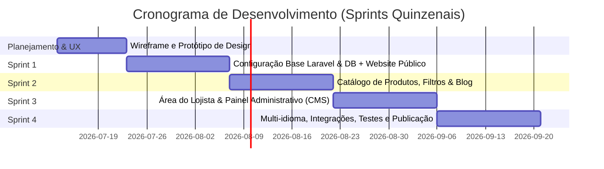

# Proposta Técnica e Estimativa Orçamentária
**Desenvolvimento de Website Institucional, Catálogo de Produtos e Área do Lojista**  
*Baseado no modelo referencial: [ESEL - Esquadrias Eidt](https://esel.com.br)*

---

## 1. Introdução e Visão Geral do Projeto

Esta proposta contempla o desenvolvimento de uma plataforma web de alto padrão para apresentação institucional, catálogo digital de produtos e portal de relacionamento com lojistas. O projeto será construído sob medida, priorizando **desempenho, segurança, escalabilidade, design responsivo (mobile-first)** e conformidade com as melhores práticas de SEO e desenvolvimento de software.

Como referência, adotamos a estrutura e funcionalidade do site **esel.com.br**, que se destaca pela sua organização de catálogo, suporte a múltiplos idiomas e um canal restrito de acesso para parceiros comerciais (Lojistas).

---

## 2. Escopo Técnico e Funcionalidades

O escopo do projeto foi dividido em quatro módulos principais para assegurar uma entrega ágil e incremental.

```mermaid
graph TD
    A[Website Público] --> A1[Home & Quem Somos]
    A --> A2[Catálogo de Produtos Dinâmico]
    A --> A3[Notícias / Blog]
    A --> A4[Contato & Fale Conosco]
    
    B[Área do Lojista] --> B1[Autenticação & Registro]
    B --> B2[Downloads de Tabelas e Catálogos]
    B --> B3[Solicitações de Orçamentos Exclusivos]
    
    C[Painel Administrativo - CMS] --> C1[Gestão de Produtos e Categorias]
    C --> C2[Gestão de Conteúdo e Notícias]
    C --> C3[Gerenciamento de Lojistas e Leads]
    
    D[Infraestrutura & SEO] --> D1[Otimização SEO Local & Global]
    D --> D2[Multi-idioma: PT, EN, ES]
    D --> D3[Integração com CRM/WhatsApp]
```

### Módulo 1: Website Público & Institucional
*   **Página Inicial (Home):** Banner principal dinâmico (slideshow de alta performance), apresentação rápida dos principais segmentos de produtos (Portas, Janelas, etc.), destaques de lançamentos, dados de relevância da empresa (contador estatístico de portas entregues, clientes e anos de mercado), depoimentos/valores e chamada para ação (CTA).
*   **Quem Somos:** Página institucional detalhando a história da marca, compromisso sustentável, tecnologia industrial e diferencial competitivo.
*   **Catálogo Digital de Produtos:**
    *   Navegação organizada por categorias (ex: Portas Premium, Portas Internas, Janelas Gold, Vitrôs, Móveis de Jardim).
    *   Filtros inteligentes por tipo de madeira, acabamento e dimensões.
    *   **Página de Detalhes do Produto:** Galeria de imagens com zoom, especificações técnicas detalhadas, download de manuais ou catálogos PDF do produto e formulário direto para cotação.
*   **Blog / Novidades:** Espaço de conteúdo dinâmico focado em dicas de conservação de madeira, arquitetura, design e novidades corporativas (essencial para atração de tráfego orgânico/SEO).
*   **Fale Conosco / Contato:** Formulário completo de contato com envio de e-mails via fila (fila assíncrona do Laravel), integração com Google Maps para localização física e botão flutuante inteligente de redirecionamento para o WhatsApp corporativo.
*   **Suporte Multilíngue:** Tradução estrutural para **Português, Inglês e Espanhol**, permitindo expansão e consultas internacionais.

### Módulo 2: Área do Lojista (Portal do Parceiro)
*   **Autenticação Segura:** Cadastro de novos parceiros (com validação de CNPJ), login e recuperação de senha.
*   **Dashboard Restrito:** Ambiente personalizado para o lojista parceiro.
*   **Downloads Exclusivos:** Acesso a tabelas de preços vigentes, catálogos técnicos em PDF de alta qualidade, termos de garantia e materiais promocionais de ponto de venda.
*   **Solicitação de Orçamento Rápido:** Formulário otimizado para o lojista enviar múltiplos códigos de produtos para cotação imediata.

### Módulo 3: Painel Administrativo Personalizado (CMS)
*   **Gestão de Produtos:** Cadastro, edição e exclusão de categorias e itens (com upload e otimização automatizada de fotos).
*   **Gestão de Idiomas:** Painel para revisão simples das traduções dinâmicas do site.
*   **Gerenciamento do Blog:** Editor de texto rico (WYSIWYG) para publicação de artigos com tags amigáveis para SEO.
*   **Moderação de Lojistas:** Aprovação ou rejeição manual de novos cadastros de lojistas, garantindo controle dos dados compartilhados.
*   **Monitoramento de Leads:** Relatório unificado de todas as solicitações de contato e pedidos de orçamento recebidos.

### Módulo 4: Infraestrutura & Integrações
*   **Integrações de API:** Integração com APIs de envio de e-mail (Mailgun, SendGrid ou SMTP local), API de geolocalização e ferramentas de análise (Google Analytics 4, Tag Manager).
*   **Boas Práticas de Programação:** Código com cobertura de testes unitários (Pest/PHPUnit), arquitetura limpa em MVC, rotas amigáveis, segurança contra injeções SQL, CSRF e XSS.

---

## 3. Tecnologias Propostas

Utilizaremos uma stack de mercado robusta, moderna e escalável, garantindo fácil manutenção futura e alta velocidade de carregamento (Core Web Vitals excelentes):

| Camada | Tecnologia | Justificativa |
| :--- | :--- | :--- |
| **Backend** | **PHP 8.2+ / Laravel 10/11** | Framework robusto, excelente suporte a MVC, segurança nativa, tratamento de filas de e-mail e manipulação simples de banco de dados por meio do Eloquent ORM. |
| **Banco de Dados** | **MySQL 8.0** | Banco relacional otimizado para a estrutura de produtos, categorias, lojistas e permissões. |
| **Frontend** | **Tailwind CSS / Blade / JavaScript ES6 / Alpine.js** | Design rápido, limpo e responsivo sem comprometer a performance. Alpine.js trará microinterações fluidas sem a sobrecarga de frameworks SPA pesados. |
| **Asset Bundling** | **Vite** | Compilação ultrarrápida de scripts e estilos CSS para otimização do tempo de carregamento da página. |
| **Hospedagem / DevOps** | **Docker / VPS Linux (Ubuntu) / Nginx** | Ambiente de desenvolvimento idêntico ao de produção. Configuração em servidores VPS modernos (ex: DigitalOcean ou AWS) para estabilidade e custos sob medida. |

---

## 4. Cronograma e Prazos

O prazo médio estimado para o desenvolvimento completo é de **8 semanas** (aproximadamente 2 meses), dividido em 4 Sprints quinzenais:

*   **Semana 1-2 (Planejamento e Design):** Criação dos wireframes de alta fidelidade e definição da identidade visual baseada no modelo Esel.
*   **Semana 3-4 (Sprint 1 - Estruturação & Core):** Configuração do Laravel, banco de dados MySQL, área pública (Home, Quem Somos, Contato) com foco em responsividade e design fluido.
*   **Semana 5-6 (Sprint 2 - Catálogo & Blog):** Desenvolvimento completo do Catálogo de Produtos estruturado, com páginas de detalhes, blog integrado e busca funcional.
*   **Semana 7-8 (Sprint 3 - Área do Lojista & CMS):** Desenvolvimento do sistema de autenticação de lojistas, painel restrito para downloads de materiais e o painel administrativo (CMS) para gestão geral.
*   **Semana 9-10 (Sprint 4 - Multi-idioma, Integração & Go-Live):** Implementação final das traduções (PT, EN, ES), SEO avançado, testes integrados (Pest), preparação do servidor VPS e deploy de produção.

---

## 5. Forma de Trabalho e Metodologia

Adoto uma metodologia focada em transparência e colaboração activa, estruturada nos seguintes pilares:

*   **Comunicação Ágil:** Reuniões rápidas quinzenais (ou semanais) para apresentação de status e validação do progresso das Sprints.
*   **Ferramenta de Acompanhamento:** Utilização do **Trello** ou **Asana** para acompanhamento visual do status do projeto em tempo real.
*   **Controle de Versão:** Uso de Git corporativo com repositório privado no **GitHub** ou **GitLab**, assegurando total rastreabilidade do código.
*   **Processo de Feedback:** Ao final de cada Sprint, uma versão do sistema é atualizada no ambiente de homologação (staging) para testes e feedback direto do cliente.
*   **Boas Práticas de Código:**
    *   Uso de padrões de projeto consolidados (Design Patterns PSR do PHP).
    *   Código documentado e legível.
    *   Testes unitários e de integração para evitar regressões futures.
    *   Camada de segurança contra injeções SQL, CSRF e sanitização de dados de entrada.

---

## 6. Portfólio e Casos de Sucesso

Como especialista em PHP, Laravel e MySQL, conto com uma trajetória voltada para o desenvolvimento de soluções robustas para o setor industrial e corporativo. Abaixo constam alguns exemplos de projetos de escopo similar já desenvolvidos:

1.  **Sistema de Cotação de Produtos (Abastece Já Compras):**
    *   *Descrição:* Desenvolvimento de um sistema dinâmico de cotação de produtos.
    *   *Tecnologias:* PHP 8.1, Laravel, MySQL, Alpine.js e Tailwind CSS.
    *   *Resultado:* Agilização do processo de cotação de produtos.
2.  **SisGraxaria - Sistema de Gestão para Graxaria (Reciclagem Animal):**
    *   *Descrição:* O SisGraxaria é uma solução completa desenvolvida para automatizar e otimizar os processos operacionais de uma indústria de graxaria (unidade de reciclagem de subprodutos de origem animal).
    *   *Tecnologias:* Laravel 10, MySQL, Redis para filas de e-mail e painel CMS sob medida.
    *   *Resultado:* O sistema gerencia de forma integrada desde a coleta de matéria-prima (ossos, gordura, miúdos de açougues, supermercados e frigoríficos), a pesagem, o controle dos lotes de processamento, a produção de subprodutos (sebo e farinha de carne/ossos), até a venda final aos clientes (fábricas de rações, sabões, biodiesel, etc.).

---

## 7. Investimento Estimado e Condições

O investimento total para o desenvolvimento da plataforma descrita, considerando o escopo completo (Institucional + Catálogo de Produtos + Área do Lojista + CMS + Suporte Multilíngue), é de:

### **R$ 6.800,00** (Seis mil e oitocentos reais)

#### Sugestão de Divisão por Etapas (Pagamento Baseado em Milestones):

*   **Sinal / Entrada (Aprovação da Proposta e Design Inicial):** R$ 1.700,00 (25%)
*   **Entrega da Sprint 1 & 2 (Site Público e Catálogo Funcional):** R$ 1.700,00 (25%)
*   **Entrega da Sprint 3 (Área do Lojista e Painel CMS):** R$ 1.700,00 (25%)
*   **Homologação Final, Deploy em Produção e Transferência de Código (Go-live):** R$ 1.700,00 (25%)

*Nota: Condições e parcelamentos podem ser renegociados de acordo com o fluxo financeiro de sua empresa.*

---

## 8. Considerações Finais e Próximos Passos

Esta proposta reflete um compromisso de desenvolvimento com foco em excelência técnica, entrega no prazo e código limpo utilizando as ferramentas mais respeitadas no mercado moderno de PHP e Laravel.

**Caso concorde com a proposta, os próximos passos seriam:**
1. Alinhamento de detalhes contratuais e cronograma detalhado de reuniões.
2. Assinatura do contrato de prestação de serviços.
3. Abertura do repositório Git e criação do board no Trello para iniciarmos a fase de Planejamento e Design de Wireframes.

Coloco-me à inteira disposição para agendarmos uma chamada de vídeo para sanar quaisquer dúvidas ou realizar ajustes finos neste orçamento.

**Atenciosamente,**  
*Desenvolvedor de Software Web Sênior*  
*Foco em PHP, Laravel, MySQL e Soluções Sob Demanda*
